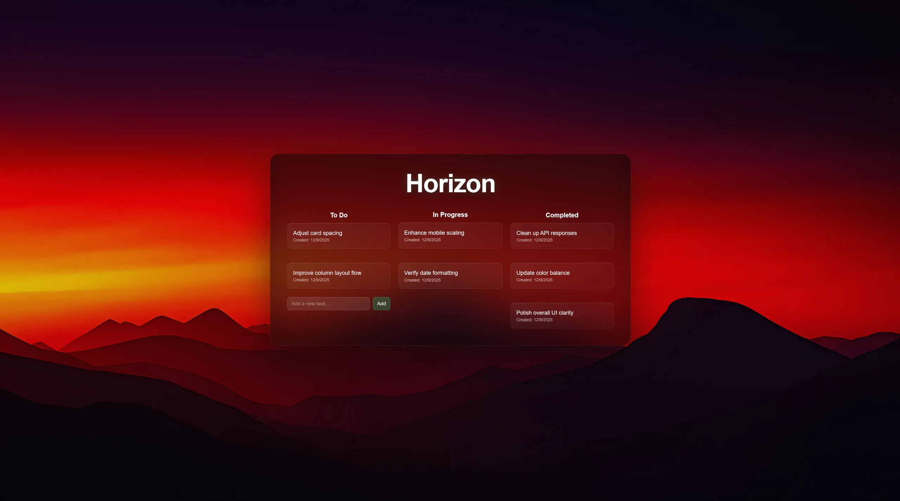

# Horizon

---

## Overview

Horizon is a minimal task board structured around fixed columns and continuous interaction.

[View](https://horizon.vmoreira.dev)

---

## Design

- Minimal surface area  
- Fast, direct interaction  
- Persistent state  
- Low-friction by default  

---

## Execution

- Next.js 15 (App Router + API Routes)  
- React 19  
- TypeScript  
- Tailwind CSS  
- Prisma ORM (v6)  
- PostgreSQL (NeonDB)  
